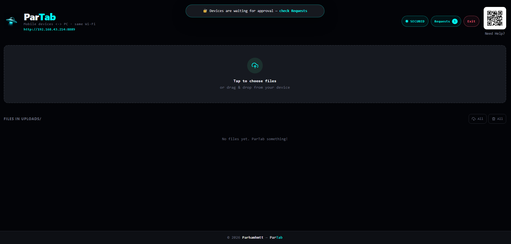

# ParTab 🛸

### Instant wireless file transfer between devices on the same Wi-Fi


Transfer files directly between your computer, phones, and tablets over the local Wi-Fi network — no cables, cloud uploads, accounts, or companion apps required.

ParTab runs a lightweight Python server on the host computer and exposes a responsive browser interface to devices on the same network.

---

## ⬇️ Download ParTab v2 for Windows

Don't want to install Python? Download the prebuilt Windows executable from GitHub Releases.

**Current release:** `Partab-v2.0.0.exe`

[**Download from GitHub Releases →**](https://github.com/parhamhmtt/ParTab/releases)

After downloading:

1. Run `Partab-v2.0.0.exe`.
2. Windows may ask for firewall permission — allow access on your private network.
3. ParTab opens the host page in your browser.
4. Scan the QR code or open the Mobile URL from another device on the same Wi-Fi.

> The Windows `.exe` is built from the same source code in this repository using PyInstaller. Python does not need to be installed to run the packaged executable.

---

## ✨ Features

- ⚡ Fast local file transfer over Wi-Fi
- 📱 Works from mobile and desktop browsers
- 🖥️ Responsive desktop & mobile interface
- 📂 Multi-file upload support
- 🖱️ Drag & drop uploads on desktop
- 📊 Real-time upload progress
- 📡 Live upload progress is visible on other connected devices
- 🔄 Real-time file list updates with Server-Sent Events (SSE) — no polling
- 👥 Multiple devices can upload/download at the same time
- 📷 Built-in QR code for quick mobile access
- ⬇️ Download individual files or all files
- 🗑️ Delete individual files or all files from the browser
- 🧩 Incomplete uploads stay hidden until the transfer finishes
- 🔐 Optional `SECURED` mode with host approval
- ✅ Approve or reject multiple connection requests independently
- 🔔 Non-blocking Requests notification center on the host PC
- 🔓 Switching back to `INSECURE` automatically allows waiting devices to continue
- 🛑 Host-only Exit button for shutting down ParTab and disconnecting clients
- 💤 Automatic shutdown after the host browser tab is no longer active
- 🌐 Local-network operation — transferred files are not uploaded to a cloud service
- 🧱 Modular Python architecture

---

# 📸 Preview & Screenshots

## Console Interface

```text
╔══════════════════════════════════════╗
             ParTab  🚀
╠══════════════════════════════════════╣
║ Local  →  http://localhost:8889      ║
║ Mobile →  http://192.168.1.42:8889   ║
╠══════════════════════════════════════╣
║ Open the Mobile URL on your phone    ║
║ (same Wi-Fi required)                ║
╚══════════════════════════════════════╝
```

## Web UI



---

# 🚀 Quick Start

## 1 · Clone the Repository

```bash
git clone https://github.com/parhamhmtt/ParTab.git
cd ParTab
```

## 2 · Install Dependencies

```bash
pip install -r requirements.txt
```

Current dependencies include:

- `psutil`
- `qrcode[pil]`

## 3 · Run ParTab

```bash
python ParTab.py
```

If your system uses `python3`:

```bash
python3 ParTab.py
```

ParTab opens the host page automatically and prints both the local and mobile URLs in the terminal.

## 4 · Connect Another Device

Make sure both devices are connected to the same Wi-Fi network.

Then either:

- scan the QR code shown by ParTab, or
- open the displayed Mobile URL manually.

Example:

```text
http://192.168.1.42:8889
```

No app needs to be installed on the phone or tablet.

---

# 📱 Using ParTab

## Upload Files

1. Open ParTab in a browser.
2. Tap **Choose Files** or drag files into the drop area.
3. Select one or more files.
4. Tap **Upload Files**.

Uploaded files are stored in:

```text
uploads/
```

While an upload is running, other connected ParTab pages receive its progress in real time through SSE.

Example:

```text
Phone 1
Uploading video.mp4
██████████████░░░░ 72%

        ↓ SSE

PC Browser
Live uploads
video.mp4
██████████████░░░░ 72%
```

Incomplete uploads are written to a temporary staging directory and are not shown in the normal file list until the upload completes successfully.

## Download Files

Completed files appear in the file list.

Use the download button beside a file to download it, or use **All** to start downloads for all available files.

## Delete Files

Files can be deleted directly from the browser.

You can delete:

- a single file, or
- all current files.

When a file is added or deleted, connected browsers receive a real-time `files_changed` event and update immediately.

---

# 📡 Real-Time Updates with SSE

ParTab v2 uses **Server-Sent Events (SSE)** for real-time server-to-browser updates.

In the older approach, each browser had to ask the server every few seconds whether something had changed. That is called **polling**.

For example:

```text
Browser → "Anything changed?"
Browser → "Anything changed?"
Browser → "Anything changed?"
```

ParTab no longer needs to do that.

With SSE, every connected browser keeps one lightweight event stream open. When something actually happens, the ParTab server pushes an event immediately:

```text
Phone uploads a file
        ↓
ParTab Server
        ↓ SSE
   ┌────┴────┐
   PC      Phone 2
   ↓          ↓
updates     updates
instantly   instantly
```

This is used for events such as:

```text
files_changed
upload_started
upload_progress
upload_completed
upload_aborted
connection_request
security_changed
access_decision
server_shutdown
```

So connected devices can react in real time when:

- another device starts uploading a file,
- upload progress changes,
- an upload completes or is interrupted,
- a file is added or deleted,
- a new Secure Mode connection request arrives,
- the host changes between `SECURED` and `INSECURE`,
- an access request is approved or rejected,
- the host shuts down ParTab.

### Why SSE instead of WebSocket?

ParTab mainly needs real-time communication in one direction:

```text
Server → Browser
```

Normal uploads, downloads, and file actions still use regular HTTP requests.

Because of that, SSE keeps the real-time layer simple without introducing a full WebSocket connection for every action.

Browsers also handle short connection interruptions well: `EventSource` automatically attempts to reconnect when the network connection is temporarily lost.

> SSE is used for live notifications and UI synchronization. File transfers themselves still happen over normal HTTP.

---

# 🔐 Secure / Insecure Mode

ParTab v2 has two access modes so you can choose between convenience and host-controlled access.

## INSECURE

`INSECURE` is the simple, open mode.

```text
Device opens ParTab
        ↓
Immediate access
```

A phone, tablet, or computer that can reach the ParTab address on the same local network can open the interface immediately without asking the host for approval.

This mode is useful when:

- you are on your own trusted Wi-Fi,
- you want the fastest possible connection flow,
- you do not need to approve every device manually.

The host UI shows `INSECURE` in red as a reminder that device approval is disabled.

> `INSECURE` does not mean ParTab is automatically exposed to the public internet. It means ParTab does not require per-device approval from clients that can already reach the server on the local network.

## SECURED

`SECURED` enables host approval.

A new device cannot access the transfer interface until the host PC explicitly approves it.

```text
Phone opens ParTab
        ↓
Waiting for approval
        ↓
Host receives a request
        ↓
Approve / Reject
        ↓
Access granted or denied
```

Only the **host PC** can:

- switch between `SECURED` and `INSECURE`,
- approve devices,
- reject devices,
- shut down the ParTab server.

A remote phone or tablet cannot disable Secure Mode by itself.

Approved access is tied to the connecting device session using a server-issued access token.

### Connection Requests

When one or more devices are waiting for approval, ParTab does not cover the host screen with blocking popups.

Instead, the host receives a small notification:

```text
🔐 Devices are waiting for approval — check Requests
```

The **Requests** control keeps the number of pending devices visible:

```text
Requests 2
```

Opening it shows all pending devices separately, so each one can be approved or rejected independently and in any order.

The rest of the ParTab interface stays usable while requests are waiting.

### What happens to a waiting or rejected device?

If ParTab is currently `SECURED`, the device stays on the waiting/denied flow until the host allows access.

If the host later switches back to `INSECURE`, waiting or previously rejected devices are allowed to continue automatically through the existing SSE connection.

No manual refresh is required.

### What happens after a server restart?

Secure approvals are runtime state. After restarting ParTab, a device may need to request approval again if the server is running in `SECURED` mode.

This is intentional: old approval state is not silently trusted after a fresh server session.

## Important Security Note

`SECURED` mode means **device approval**, not transport encryption.

It does **not** turn ParTab into HTTPS and it does not encrypt the HTTP traffic traveling across the local network.

So:

```text
SECURED = Host controls who gets access
HTTPS   = Network traffic is encrypted
```

They solve different problems.

ParTab is primarily designed for trusted/private local networks.

For sensitive transfers on an untrusted network, use an encrypted network layer such as a trusted VPN, or place ParTab behind HTTPS.

---

# 👥 Multiple Devices

ParTab uses a threaded server, so multiple browsers can stay connected at the same time.

For example:

```text
                 ParTab
              /    |    \
             /     |     \
           PC   Phone 1  Phone 2
           SSE     SSE     SSE
                    │       │
                 upload   download
```

Long-lived SSE connections do not block normal upload/download requests.

Each live upload is tracked independently, so simultaneous transfers keep separate progress states.

---

# 🛑 Exit & Server Shutdown

The host PC has an **Exit** button.

Pressing it opens an in-app confirmation dialog before anything is stopped.

After confirmation:

1. ParTab broadcasts a `server_shutdown` SSE event.
2. Connected browsers are informed that the host stopped the server.
3. Browsers attempt to close the ParTab tab.
4. If the browser does not allow JavaScript to close a manually opened tab, the page falls back to a **ParTab stopped** screen.
5. The Python server shuts down.

The Exit endpoint is host-only; remote phones/tablets cannot use it to shut down ParTab.

You can also stop the server from the terminal with:

```text
CTRL + C
```

ParTab also watches the host browser connection. If the host tab disappears and does not reconnect, the server automatically shuts down after roughly 90 seconds.

---

# 🌐 Browser Support

Designed for modern browsers including:

- Safari on iPhone/iPad
- Chrome
- Edge
- Firefox

SSE support through `EventSource` is required for real-time behavior.

---

# 🔒 Privacy

ParTab is local-first:

- no accounts,
- no analytics,
- no tracking,
- no cloud file storage,
- no external transfer server.

Transferred files stay on the local host computer and are served directly across the local network.

Internet access is not required for normal file transfers after the project and dependencies are installed.

---

# 📂 Project Structure

ParTab is split into focused modules instead of keeping the complete server, UI, networking, and security logic in one Python file.

```text
ParTab/
│
├── ParTab.py                  # Entry point
│
├── partab/
│   ├── __init__.py
│   ├── events.py              # SSE event broker
│   ├── files.py               # File listing / size helpers
│   ├── handler.py             # HTTP routes, uploads, downloads, API
│   ├── network.py             # Local IP / port handling
│   ├── page.py                # HTML template loading
│   ├── paths.py               # Runtime/resource paths
│   ├── qr.py                  # QR generation
│   ├── security.py            # Secure mode & approval state
│   ├── server.py              # Threaded server lifecycle
│   └── state.py               # Shared runtime state
│
├── templates/
│   ├── index.html             # Main web interface
│   └── waiting.html           # Secure-mode waiting page
│
├── assets/
│   ├── desktop.png
│   ├── app.ico
│   └── logo.png
│
├── uploads/                   # Created at runtime, ignored by Git
├── .gitignore
├── requirements.txt
├── LICENSE
└── README.md
```

---

# ⚙️ Configuration

## Port

The default port is configured in:

```text
partab/state.py
```

```python
port = 8889
```

If the port is already in use, ParTab first tries to free it. If that is not possible, it searches nearby ports for a free one.

## Upload Directory

The upload path is managed in:

```text
partab/paths.py
```

By default ParTab creates:

```text
uploads/
```

next to the application/project runtime directory.

Temporary incomplete uploads are kept under:

```text
uploads/.partab_tmp/
```

and are only moved into the normal upload directory after a complete file has been received.

---

# 🔥 Can't Reach the Page?

Windows Firewall may block incoming connections.

Run PowerShell as Administrator:

```powershell
netsh advfirewall firewall add rule name="ParTab" dir=in action=allow protocol=TCP localport=8889
```

If ParTab starts on another port, replace `8889` with the port printed in the terminal.

To remove the firewall rule later:

```powershell
netsh advfirewall firewall delete rule name="ParTab"
```

---

# 🛠 Troubleshooting

| Problem | Solution |
|---|---|
| Phone can't connect | Make sure the phone and computer are on the same Wi-Fi |
| QR code does not open ParTab | Open the displayed Mobile URL manually |
| URL shows `127.0.0.1` | Check Wi-Fi/VPN/network adapter configuration and restart ParTab |
| Windows blocks the connection | Add a firewall rule for the active ParTab port |
| Upload is interrupted | Retry the upload; incomplete files are not exposed as completed files |
| Device is stuck on the approval page | Approve it from **Requests**, or switch the host back to `INSECURE` |
| A rejected device should be allowed again | Switch to `INSECURE`, or re-enable `SECURED` and let it request access again |
| Exit cannot close a browser tab | The browser may block `window.close()` for manually opened tabs; ParTab shows a stopped screen instead |
| Port is already in use | ParTab attempts to free it or select another available port |
| `python ParTab.py` does not work | Try `python3 ParTab.py` and confirm Python 3.10+ is installed |

---

# 🧠 How It Works

At a high level:

```text
Browser / Phone
      │
      ├── HTTP upload / download / delete
      │
      └── SSE event stream
               │
               ▼
        Threaded ParTab Server
          │       │       │
          │       │       └── Security / approvals
          │       └────────── File management
          └────────────────── Real-time event broker
```

Normal file transfers use HTTP.

Real-time notifications use SSE, which is a good fit for ParTab because most live updates flow from the server to connected browsers.

The host remains in control of Secure Mode and shutdown actions.

---

# 📦 Building the Windows EXE

ParTab v2 can be packaged as a standalone Windows executable with PyInstaller.

The release executable is named:

```text
Partab-v2.0.0.exe
```

## Build locally on Windows

The easiest option is to double-click:

```text
build_exe.bat
```

The script automatically:

1. creates an isolated build environment,
2. downloads the packages from `requirements.txt`,
3. installs PyInstaller,
4. embeds the Python runtime, dependencies, templates, and assets,
5. creates one standalone executable.

You only need Python 3.10+ on the computer that **builds** the EXE.

The computer that **runs** the final release does **not** need Python, pip, or any ParTab dependency installed.

The final files are created in:

```text
dist/
├── Partab-v2.0.0.exe
└── Partab-v2.0.0.exe.sha256
```

For normal users, `Partab-v2.0.0.exe` is the only application file they need to run.


## Publish a GitHub Release automatically

This repository includes:

```text
.github/workflows/release-windows.yml
```

The workflow builds the Windows executable on a real Windows GitHub Actions runner and publishes it to GitHub Releases.

For **v2.0.0**, commit and push the project first, then create and push the tag:

```bash
git tag v2.0.0
git push origin v2.0.0
```

GitHub Actions will then build:

```text
Partab-v2.0.0.exe
```

and create/update the release titled:

```text
Partab-v2.0.0
```

You can find published versions here:

[**ParTab Releases →**](https://github.com/parhamhmtt/ParTab/releases)

---

# 📜 License

ParTab is released under the MIT License.

See [LICENSE](LICENSE) for details.
